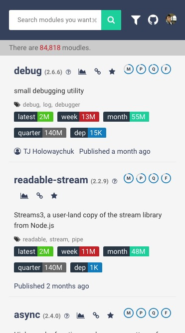
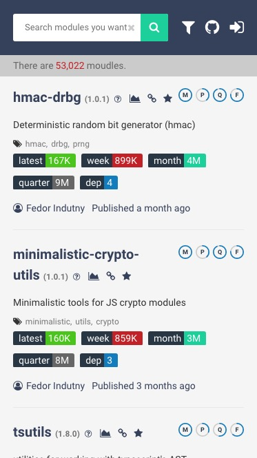
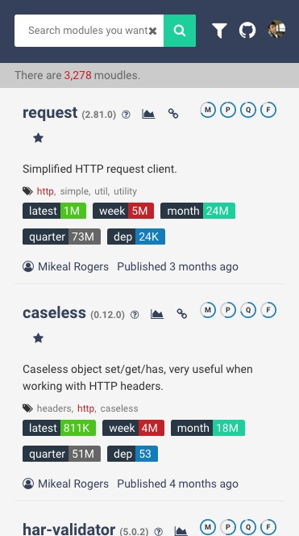
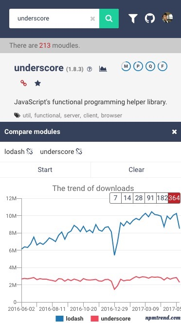
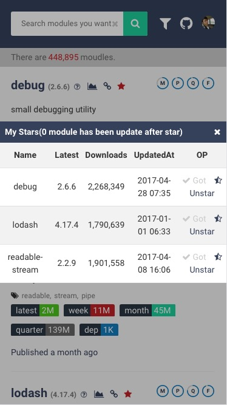

# npm-trend 

* Now the modules will not be updated, because I can't get all modules by the requst `https://registry.npmjs.org/-/all/static/all.json`. If you have a way to get all moudles, please tell me.

When I started to use `node.js`, I found the module from blog or `github trending`. The `npmjs.org` is just for searching module's latest version, I had read the top of `Most depended-upon packages` many times, but the modules are basically no change. I wanna find some more useful modules in `npmjs.org`, but there isn't enough filter way for me. Finally, I decided to sync all modules and created `npmtrend.com`

## Sort

- Updated in 90 days and sort by downloads(latest)



- Created in 90 days and sort by downloads(latest)



- Search by keyword



- Search by author
 


- Module compare(lodash vs undersocre)



- Star module




I will collect more data for support useful filter

The score of module if from `npms.io`

## Docker

### Build

```bash
docker build -t vicanso/npm-trend .
```

### ENV

```
NODE_ENV=production
MONGO=mongodb://user:pwd@ip:port/npmtrend
REDIS=redis://:pwd@ip:port/
INFLUX=http://user:pwd@ip:port/db
```

## License

MIT
